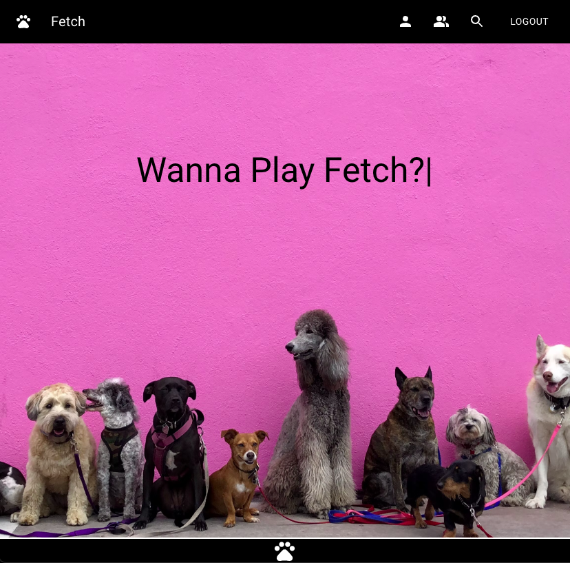
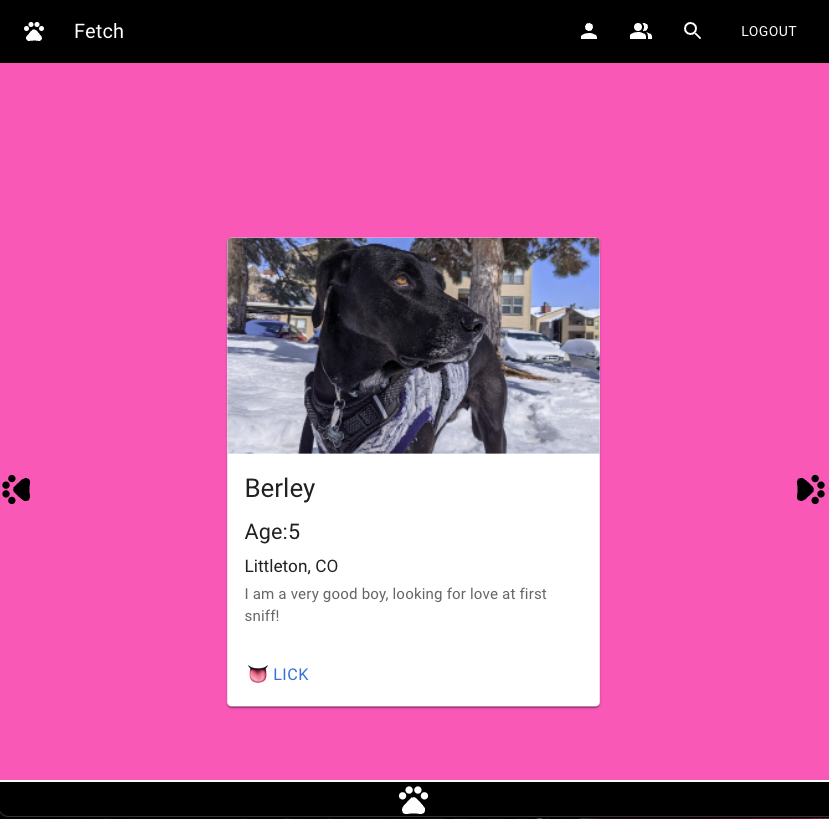

# Fetch

## Table of Contents:

- [Description](#description)
- [Usage](#usage)
- [Installation](#installation)
- [Deployed Application](#deployed-application)
- [GitHub Repo](#github-repo)
- [Screenshots](#screenshots)
- [Questions](#questions)

## Description

Fetch is a social networking website for pets! Whether your furry friend is looking for love or just a playdate, Fetch connects you to the paw-fect mate to share your toys with.

## Usage

Fetch is perfect for arranging playdates, meeting others with similar pets, and even finding love for your furry best friend. Just create a profile and start swiping!

## Installation

Join Fetch today:

- Visit the deployed application at `https://fetchdu.herokuapp.com/`

OR open the application on your local server:

- Clone down the repo to your local machine
- In the root directory run `npm run install`
- Then, run `npm run seed`
- Finally, run `npm run develop`

## [Deployed Application](https://fetchdu.herokuapp.com/)

## [GitHub Repo](https://github.com/AJShea86/Project-3-DU)

## Screenshots

## Questions

Any additional questions about this project? Please feel free to reach out:

Marissa Fandel

- Email: mfandel118@gmail.com
- GitHub: https://github.com/mfandel118

AJ Shea

- Email: Andrewsheamls@gmail.com
- GitHub: https://github.com/AJShea86

Brenden Holt

- Email: holtbrenden@yahoo.com
- GitHub: https://github.com/bholt7

Sam Posig

- Email: samposig@gmail.com
- GitHub: https://github.com/samposig

Paul Davis

- Email: pdavisDU@gmail.com
- GitHub: https://github.com/pdavisDU
